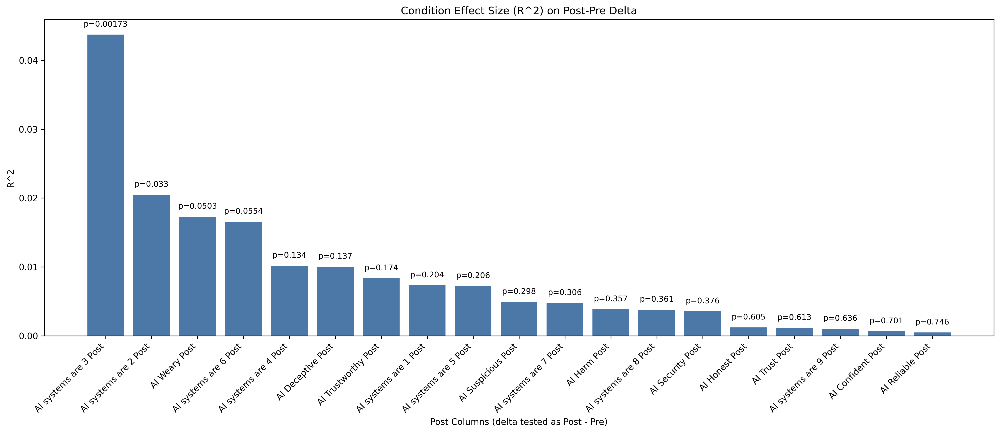
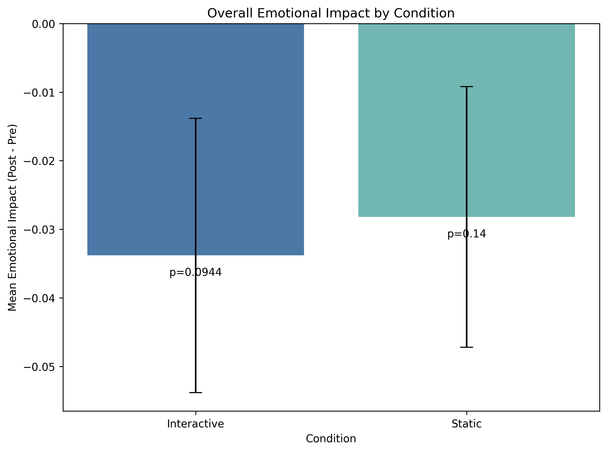
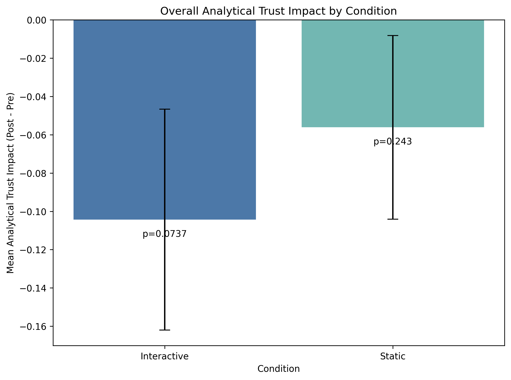
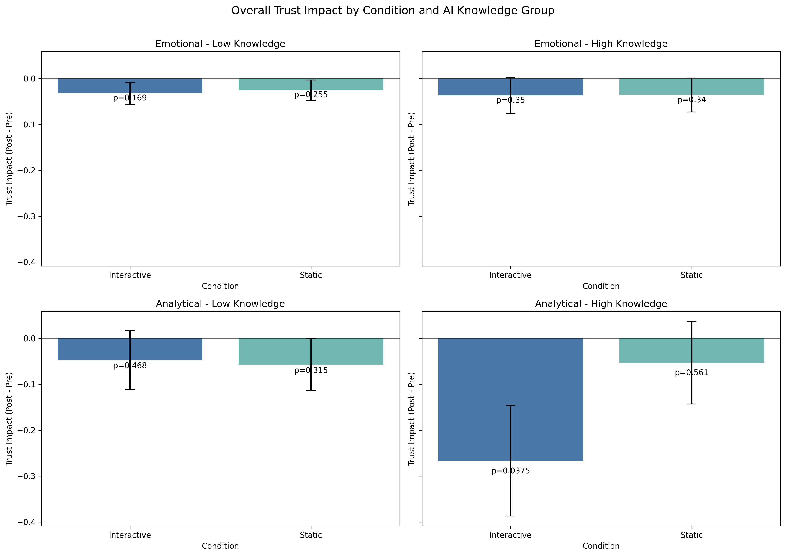

# LLM Emotional Trust Data and Analysis

This repository contains data preparation and analysis scripts for pre/post trust and emotional perception outcomes across experimental conditions.

## Data Dictionary

The `combined` dataset (for example `data/combined.csv`) includes the following columns.

| Column | Definition | Example value |
| --- | --- | --- |
| `ID` | Survey platform response ID. | `R_5Q8abc123` |
| `Start time` | Survey start timestamp. | `2026-02-17 10:45:20` |
| `Completion time` | Survey completion timestamp. | `2026-02-17 11:02:12` |
| `Email` | Email captured in survey export. | `participant@email.prolific.com` |
| `Name` | Optional name field from survey export. | `Jane Doe` |
| `Last modified time` | Last modified timestamp in survey platform. | `2026-02-17 11:02:30` |
| `Consent 1` | Consent item 1 response. | `Yes` |
| `Consent 2` | Consent item 2 response. | `Yes` |
| `Consent 3` | Consent item 3 response. | `Yes` |
| `Consent 4` | Consent item 4 response. | `Yes` |
| `Prolific or Email` | Participant identifier used for joins (Prolific ID or email). | `6980bcbe582db0ee10868525` |
| `Education` | Self-reported education level. | `Bachelor degree` |
| `AI Knowledge` | Self-reported AI knowledge category. | `Conceptual understanding` |
| `Age` | Survey age response field. | `24` |
| `AI Deceptive` | Pre item: AI systems are deceptive (Likert). | `Disagree` |
| `AI Honest` | Pre item: AI systems behave honestly (Likert). | `Agree` |
| `AI Suspicious` | Pre item: suspicion of AI intent/actions/outputs (Likert). | `Agree` |
| `AI Weary` | Pre item: wariness of AI systems (Likert). | `Disagree` |
| `AI Harm` | Pre item: expectation of harmful outcomes (Likert). | `Disagree` |
| `AI Confident` | Pre item: confidence in AI systems (Likert). | `Agree` |
| `AI Security` | Pre item: AI provides security (Likert). | `Disagree` |
| `AI Trustworthy` | Pre item: AI systems are trustworthy (Likert). | `Agree` |
| `AI Reliable` | Pre item: AI systems are reliable (Likert). | `Agree` |
| `AI Trust` | Pre item: I can trust AI systems (Likert). | `Agree` |
| `AI systems are 1` | Pre bipolar emotional item 1. | `Empathetic` |
| `AI systems are 2` | Pre bipolar emotional item 2. | `Sensitive` |
| `AI systems are 3` | Pre bipolar emotional item 3. | `Personal` |
| `AI systems are 4` | Pre bipolar emotional item 4. | `Caring` |
| `AI systems are 5` | Pre bipolar emotional item 5. | `Altruistic` |
| `AI systems are 6` | Pre bipolar emotional item 6. | `Cordial` |
| `AI systems are 7` | Pre bipolar emotional item 7. | `Responsive` |
| `AI systems are 8` | Pre bipolar emotional item 8. | `Open-Minded` |
| `AI systems are 9` | Pre bipolar emotional item 9. | `Patient` |
| `AI Weary Post` | Post item paired with `AI Weary`. | `Disagree` |
| `AI Confident Post` | Post item paired with `AI Confident`. | `Agree` |
| `AI Suspicious Post` | Post item paired with `AI Suspicious`. | `Disagree` |
| `AI Trust Post` | Post item paired with `AI Trust`. | `Agree` |
| `AI Harm Post` | Post item paired with `AI Harm`. | `Strongly Disagree` |
| `AI Honest Post` | Post item paired with `AI Honest`. | `Agree` |
| `AI Security Post` | Post item paired with `AI Security`. | `Disagree` |
| `AI Deceptive Post` | Post item paired with `AI Deceptive`. | `Disagree` |
| `AI Reliable Post` | Post item paired with `AI Reliable`. | `Agree` |
| `AI Trustworthy Post` | Post item paired with `AI Trustworthy`. | `Agree` |
| `AI systems are 1 Post` | Post bipolar emotional item 1. | `Apathetic` |
| `AI systems are 2 Post` | Post bipolar emotional item 2. | `Insensitive` |
| `AI systems are 3 Post` | Post bipolar emotional item 3. | `Impersonal` |
| `AI systems are 4 Post` | Post bipolar emotional item 4. | `Ignoring` |
| `AI systems are 5 Post` | Post bipolar emotional item 5. | `Self-Serving` |
| `AI systems are 6 Post` | Post bipolar emotional item 6. | `Rude` |
| `AI systems are 7 Post` | Post bipolar emotional item 7. | `Indifferent` |
| `AI systems are 8 Post` | Post bipolar emotional item 8. | `Judgmental` |
| `AI systems are 9 Post` | Post bipolar emotional item 9. | `Impatient` |
| `AI Feel Post` | Post item: feeling after reading/interaction prompt. | `Somewhat positive` |
| `AI Understand Post` | Post item: need model understanding to trust. | `Agree` |
| `AI Job Post` | Post item: feeling about AI job screening. | `Uncomfortable` |
| `Condition` | Experimental condition label. | `Interactive` |
| `Interactive Page Title List` | List of page titles in interactive submissions for participant. | `['Introduction', 'Case 1']` |
| `Interactive Section Title List` | List of section titles in interactive submissions. | `['Context', 'Answer']` |
| `Interactive Section Index List` | List of section indexes in interactive submissions. | `[0, 1, 2]` |
| `Interactive Original Text List` | List of original text edits/interactions. | `['original snippet ...']` |
| `Interactive Updated Text List` | List of updated text edits/interactions. | `['updated snippet ...']` |
| `Response Section Title List` | List of student response section titles. | `['Q1', 'Q2']` |
| `Response Section Index List` | List of student response section indexes. | `[0, 1]` |
| `Response Text List` | List of free-text response strings. | `['I think ...', 'My answer ...']` |
| `Response Created At List` | List of response creation timestamps. | `['2026-02-17T10:50:01Z']` |
| `Response Updated At List` | List of response update timestamps. | `['2026-02-17T10:51:12Z']` |
| `Submission id` | Prolific submission ID from demographics export. | `65f1abc123` |
| `Participant id` | Prolific participant ID from demographics export. | `6980bcbe582db0ee10868525` |
| `Status` | Prolific submission status. | `APPROVED` |
| `Custom study tncs accepted at` | Timestamp for custom T&Cs acceptance. | `2026-02-17 10:44:01` |
| `Started at` | Prolific start timestamp. | `2026-02-17 10:44:12` |
| `Completed at` | Prolific completion timestamp. | `2026-02-17 11:03:01` |
| `Reviewed at` | Prolific review timestamp. | `2026-02-18 09:12:22` |
| `Archived at` | Prolific archive timestamp if archived. | `NaN` |
| `Time taken` | Time spent in study (seconds/minutes depending on export). | `1125` |
| `Completion code` | Completion code used for reward. | `ABC123XYZ` |
| `Total approvals` | Participant total approvals on Prolific. | `145` |
| `Gender` | Self-reported gender. | `Female` |
| `Ethnicity` | Self-reported ethnicity. | `White` |
| `Age_demographic` | Age from demographics export (separate from survey age field). | `24` |
| `Sex` | Self-reported sex. | `Female` |
| `Ethnicity simplified` | Simplified ethnicity category from Prolific export. | `White` |
| `Country of birth` | Country of birth from demographics export. | `France` |
| `Country of residence` | Country of residence from demographics export. | `Luxembourg` |
| `Nationality` | Nationality from demographics export. | `French` |
| `Language` | Primary language from demographics export. | `English` |
| `Student status` | Student status from demographics export. | `Student` |
| `Employment status` | Employment status from demographics export. | `Part-time` |

## Script Guide and Results

### `conditions.py`

Purpose:
- Removes participants who appear in both conditions.
- Merges survey data with demographics.
- Filters to approved participants.
- Writes cleaned combined dataset used by downstream analyses.

Key outputs:
- `data/all/grouped_with_interactions_no_cross_condition.csv`
- `data/all/combined_with_demographics.csv`
- `data/combined.csv`
- `data/combined.pkl`

### `statistics.py`

Purpose:
- Computes condition effects on per-item `Post - Pre` deltas.
- Reports test statistics, p-values, and `R^2` effect sizes.

Key outputs:
- `analysis/post_delta_condition_significance.csv`
- `analysis/post_delta_condition_r2.png`

Figure:



### `emotional.py`

Purpose:
- Aggregates overall emotional impact from `AI systems are 1..9` using participant-level mean `Post - Pre`.
- Tests each condition against 0 (no change) and reports by-condition impact.

Key outputs:
- `analysis/overall_emotional_impact_by_condition.csv`
- `analysis/overall_emotional_impact_by_condition.png`

Figure:



### `analytical.py`

Purpose:
- Aggregates overall analytical trust impact from Likert trust items (with negative-keyed item direction correction).
- Computes participant-level mean `Post - Pre` and tests each condition against 0.

Key outputs:
- `analysis/overall_analytical_trust_impact_by_condition.csv`
- `analysis/overall_analytical_trust_impact_by_condition.png`

Figure:



### `knowledge_impact.py`

Purpose:
- Repeats emotional and analytical impact analyses split by AI knowledge groups.
- Low knowledge group: `Beginner knowledge`, `Conceptual understanding`, `No knowledge`.
- High knowledge group: `Advanced`, `Expert`.
- Produces a 2x2 panel (rows: emotional/analytical, columns: low/high knowledge).

Key outputs:
- `analysis/knowledge_split_emotional_analytical_summary.csv`
- `analysis/knowledge_split_emotional_analytical_2x2.png`

Figure:



## How To Run

From project root:

```bash
python conditions.py
python statistics.py
python emotional.py
python analytical.py
python knowledge_impact.py
```
