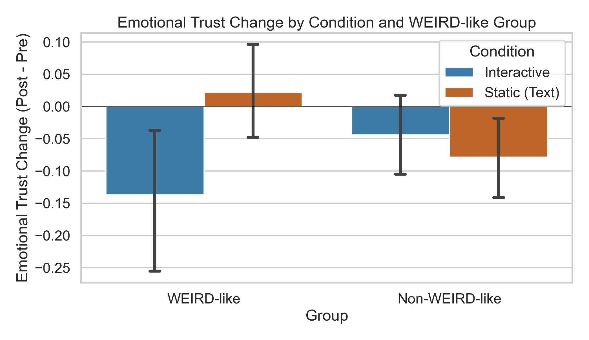
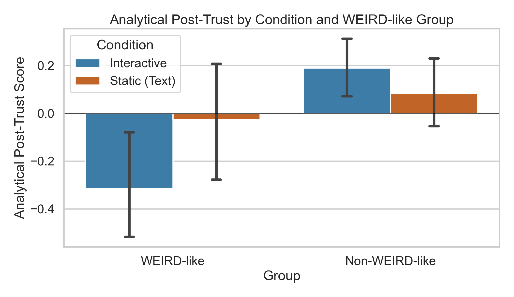

# Preliminary Trust Analysis: WEIRD-like Background x Condition

Generated on 2026-04-28 from `data/Combined.csv`.

## Research Focus

This preliminary analysis tests whether participants with WEIRD-like backgrounds respond differently to the explanation condition (Interactive vs Static/Text) for emotional versus analytical trust in AI.

## Operationalization Used

- Condition: `Interactive` vs `Text` (shown below as `Static (Text)`).
- WEIRD-like proxy: participant lives in a Western country and reports English as language.
- Emotional trust score: average of mapped emotional adjective choices ($+1$ for pro-trust adjectives, $-1$ for anti-trust adjectives).
- Analytical trust score: harmonized average of analytical trust items on a $[-2, 2]$ scale, including handling split post columns by averaging available variants.

## Sample Sizes

| WEIRD Group | Condition | n |
| --- | --- | --- |
| Non-WEIRD-like | Interactive | 192 |
| Non-WEIRD-like | Static (Text) | 192 |
| WEIRD-like | Interactive | 60 |
| WEIRD-like | Static (Text) | 60 |

## Key Interaction Results

| Metric | Interaction (Diff-in-Diff) | Permutation p |
| --- | --- | --- |
| Emotional Trust Change (Post - Pre) | -0.194 | 0.028 |
| Analytical Post-Trust Score | -0.393 | 0.045 |

Interpretation: negative interaction values indicate that Interactive (vs Static) produced a larger downward shift for the WEIRD-like group relative to the Non-WEIRD-like group.

## Figure 1: Emotional Trust Change

### Welch Tests (Interactive vs Static within each group)

| Group | n (Interactive) | n (Static) | Interactive Mean | Static Mean | Mean Difference (Interactive - Static) | Welch t | p | Cohen d |
| --- | --- | --- | --- | --- | --- | --- | --- | --- |
| WEIRD-like | 60 | 60 | -0.137 | 0.022 | -0.159 | -2.378 | 0.019 | -0.434 |
| Non-WEIRD-like | 192 | 192 | -0.044 | -0.079 | 0.035 | 0.785 | 0.433 | 0.080 |

## Figure 2: Analytical Post-Trust

### Welch Tests (Interactive vs Static within each group)

| Group | n (Interactive) | n (Static) | Interactive Mean | Static Mean | Mean Difference (Interactive - Static) | Welch t | p | Cohen d |
| --- | --- | --- | --- | --- | --- | --- | --- | --- |
| WEIRD-like | 60 | 60 | -0.314 | -0.026 | -0.288 | -1.696 | 0.093 | -0.310 |
| Non-WEIRD-like | 192 | 192 | 0.189 | 0.084 | 0.105 | 1.121 | 0.263 | 0.114 |

## Notes for Presentation

- These are exploratory, preliminary results intended for presentation-level discussion.
- The WEIRD-like proxy is an approximation based on available fields and should be sensitivity-checked in a final analysis plan.
- A reproducible numeric summary was also saved to `figures/preliminary_weird_summary.csv`.
