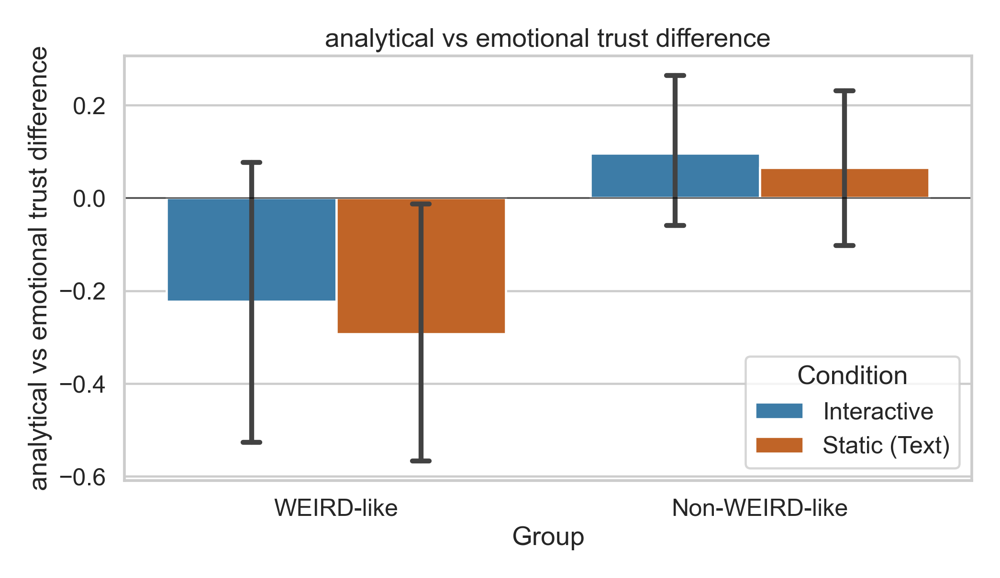

# Preliminary Version: analytical vs emotional trust difference

Generated on 2026-04-29 from `data/Combined.csv`.

This version only shows one combined metric for the 4 bars (WEIRD-like x Condition):

- `analytical_post_norm`: z-score normalized analytical post-trust
- `emotional_change_norm`: z-score normalized emotional trust change (post - pre)
- `analytical vs emotional trust difference` = `analytical_post_norm - emotional_change_norm`

## Sample Sizes

| WEIRD Group | Condition | n |
| --- | --- | --- |
| Non-WEIRD-like | Interactive | 192 |
| Non-WEIRD-like | Static (Text) | 192 |
| WEIRD-like | Interactive | 60 |
| WEIRD-like | Static (Text) | 60 |

## Interaction Result

| Metric | Interaction (Diff-in-Diff) | Permutation p |
| --- | --- | --- |
| analytical vs emotional trust difference | 0.040 | 0.873 |

## Figure

## Welch Tests (Interactive vs Static within each group)

| Group | n (Interactive) | n (Static) | Interactive Mean | Static Mean | Mean Difference (Interactive - Static) | Welch t | p | Cohen d |
| --- | --- | --- | --- | --- | --- | --- | --- | --- |
| WEIRD-like | 60 | 60 | -0.223 | -0.293 | 0.070 | 0.333 | 0.740 | 0.061 |
| Non-WEIRD-like | 192 | 192 | 0.096 | 0.066 | 0.030 | 0.241 | 0.809 | 0.025 |

A reproducible numeric summary was saved to `figures/preliminary_weird_analytical_vs_emotional_trust_difference_summary.csv`.
